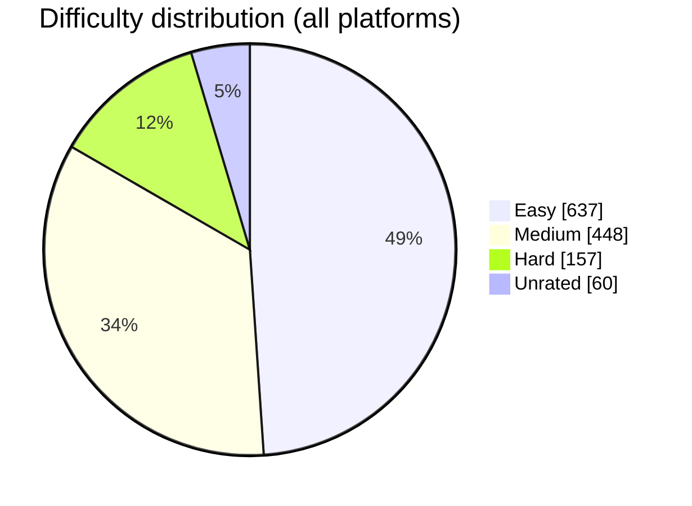

<div align="center">


<a href="https://github.com/BuildbyArindam"></a>


</div>

---

## ⚡ At a Glance

| 🧮 Solutions in repo | 🟢 Easy | 🟡 Medium | 🔴 Hard | 📅 Active days | 🔥 Longest streak |
|:---:|:---:|:---:|:---:|:---:|:---:|
| **1,302** | **637** | **448** | **157** | **50** | **50 days** |

> 📆 Logging window: **15 Aug 2026 → 03 Oct 2026** &nbsp;•&nbsp; Every file has a header with problem link, date, difficulty, topics, approach and complexity.

---

## 🔗 Coding Profiles

<div align="center">

| Platform | Handle | Link |
|:--|:--|:--:|
| 🟠 LeetCode | `0Arindam0_` | [Visit](https://leetcode.com/u/0Arindam0_/) |
| 🟢 GeeksforGeeks | `subirouynn` | [Visit](https://www.geeksforgeeks.org/user/subirouynn/) |
| 🔵 Codeforces | `mahapatraarindam4` | [Visit](https://codeforces.com/profile/mahapatraarindam4) |
| 🟤 CodeChef | `amahapatra2004` | [Visit](https://www.codechef.com/users/amahapatra2004) |
| 🟣 HackerEarth | `mahapatraarindam4` | [Visit](https://www.hackerearth.com/@mahapatraarindam4/) |
| 🟡 Unstop | `arindmah7062` | [Visit](https://unstop.com/u/arindmah7062) |
| 🧡 Coding Ninjas (Code360) | `Profile` | [Visit](https://www.naukri.com/code360/profile/fd676eb2-50b1-413c-aeea-3e8ea44e0a46) |
| ⚪ freeCodeCamp | `Profile` | [Visit](https://www.freecodecamp.org/fccdee8d2f5-58e1-4b09-9d09-2e7dafec471b) |
| 🟩 HackerRank | `mahapatraarinda1` | [Visit](http://www.hackerrank.com/profile/mahapatraarinda1) |


</div>

---

## 📂 Repository Structure

```text
Daily-Coding-Log/
└── DSA-Practice/
    ├── CodeChef/        # 345 solutions
    ├── HackerEarth/     # 300 solutions
    ├── Code360/         # 193 solutions
    ├── FreeCodeCamp/    # 184 solutions
    ├── Codeforces/      # 108 solutions
    ├── LeetCode/        # 76 solutions
    ├── GeeksforGeeks/   # 49 solutions
    └── Unstop/          # 47 solutions
```

---

## 📊 Progress by Platform

> **In repo** = solution files uploaded here (counted automatically). **Platform total** = problems solved on the site itself (manual figures).

| Platform | In repo | Share | Platform total | 🟢 Easy | 🟡 Medium | 🔴 Hard | ⚪ Unrated |
|:--|--:|:--|--:|--:|--:|--:|--:|
| [CodeChef](https://www.codechef.com/users/amahapatra2004) | **345** | `███░░░░░░░░░` 26% | 142 | 171 | 110 | 35 | 29 |
| [HackerEarth](https://www.hackerearth.com/@mahapatraarindam4/) | **300** | `███░░░░░░░░░` 23% | 154 | 198 | 78 | 12 | 12 |
| [Code360](https://www.naukri.com/code360/profile/fd676eb2-50b1-413c-aeea-3e8ea44e0a46) | **193** | `██░░░░░░░░░░` 15% | 111 | 89 | 70 | 34 | 0 |
| [FreeCodeCamp](https://www.freecodecamp.org/fccdee8d2f5-58e1-4b09-9d09-2e7dafec471b) | **184** | `██░░░░░░░░░░` 14% | 300 | 116 | 60 | 2 | 6 |
| [Codeforces](https://codeforces.com/profile/mahapatraarindam4) | **108** | `█░░░░░░░░░░░` 8% | 217 | 19 | 50 | 35 | 4 |
| [LeetCode](https://leetcode.com/u/0Arindam0_/) | **76** | `█░░░░░░░░░░░` 6% | 1,599 | 29 | 28 | 14 | 5 |
| [GeeksforGeeks](https://www.geeksforgeeks.org/user/subirouynn/) | **49** | `░░░░░░░░░░░░` 4% | 1,315 | 10 | 27 | 10 | 2 |
| [Unstop](https://unstop.com/u/arindmah7062) | **47** | `░░░░░░░░░░░░` 4% | 668 | 5 | 25 | 15 | 2 |
| **Total** | **1,302** | | | **637** | **448** | **157** | **60** |

_HackerRank (400 solved on the site) has no folder in this repo yet._

### 🎯 Difficulty Split



> **How difficulty is normalised:** Easy / Cakewalk / Beginner → Easy · Easy-Medium → Medium · Medium-Hard → Hard · Codeforces ≤1200 Easy, 1300–1900 Medium, 2000+ Hard · CodeChef rating <1200 Easy, 1200–1799 Medium, 1800+ Hard · files with no difficulty label → Unrated.

---

## 🧩 Progress by Topic

> A solution can carry several topics, so the counts add up to more than the total.

| Topic | Solutions | Distribution |
|:--|--:|:--|
| Implementation & Simulation | **478** | `████████████████████████` |
| Arrays & Prefix Sums | **326** | `████████████████░░░░░░░░` |
| Math & Number Theory | **324** | `████████████████░░░░░░░░` |
| Sorting & Searching | **230** | `████████████░░░░░░░░░░░░` |
| Hashing & Maps | **192** | `██████████░░░░░░░░░░░░░░` |
| Strings | **182** | `█████████░░░░░░░░░░░░░░░` |
| Trees | **153** | `████████░░░░░░░░░░░░░░░░` |
| Greedy | **151** | `████████░░░░░░░░░░░░░░░░` |
| Stacks, Queues & Heaps | **122** | `██████░░░░░░░░░░░░░░░░░░` |
| Graphs | **115** | `██████░░░░░░░░░░░░░░░░░░` |
| Dynamic Programming | **96** | `█████░░░░░░░░░░░░░░░░░░░` |
| Two Pointers & Sliding Window | **86** | `████░░░░░░░░░░░░░░░░░░░░` |
| Recursion & Backtracking | **75** | `████░░░░░░░░░░░░░░░░░░░░` |
| Design / OOP / SQL | **53** | `███░░░░░░░░░░░░░░░░░░░░░` |
| Bit Manipulation | **50** | `███░░░░░░░░░░░░░░░░░░░░░` |
| Linked Lists | **24** | `█░░░░░░░░░░░░░░░░░░░░░░░` |

---

## 🏆 Codeforces Rating Ladder

| Rating band | Solved | |
|:--|--:|:--|
| ≤ 1200 | **19** | `███████████████░░░░░` |
| 1300 – 1600 | **25** | `████████████████████` |
| 1700 – 1900 | **25** | `████████████████████` |
| 2000 – 2300 | **20** | `████████████████░░░░` |
| 2400+ | **15** | `████████████░░░░░░░░` |

### 💎 Hall of Fame (hardest solved)

| Rating | Problem | Solution |
|:--:|:--|:--:|
| ⭐ **2800** | DravDe Saves The World | [Code](https://github.com/BuildbyArindam/Daily-Coding-Log/blob/main/DSA-Practice/Codeforces/28E_DravDe_Saves_The_World.py) |
| ⭐ **2700** | BerPaint | [Code](https://github.com/BuildbyArindam/Daily-Coding-Log/blob/main/DSA-Practice/Codeforces/44F_BerPaint.py) |
| ⭐ **2700** | A Colourful Prospect | [Code](https://github.com/BuildbyArindam/Daily-Coding-Log/blob/main/DSA-Practice/Codeforces/934E_A_Colourful_Prospect.py) |
| ⭐ **2600** | Trial for Chief | [Code](https://github.com/BuildbyArindam/Daily-Coding-Log/blob/main/DSA-Practice/Codeforces/37E_Trial_for_Chief.py) |
| ⭐ **2600** | Testing | [Code](https://github.com/BuildbyArindam/Daily-Coding-Log/blob/main/DSA-Practice/Codeforces/39K_Testing.py) |
| ⭐ **2600** | Interesting Sequence | [Code](https://github.com/BuildbyArindam/Daily-Coding-Log/blob/main/DSA-Practice/Codeforces/40D_Interesting_Sequence.py) |
| ⭐ **2500** | Alex and a TV Show | [Code](https://github.com/BuildbyArindam/Daily-Coding-Log/blob/main/DSA-Practice/Codeforces/1097F_Alex_and_a_TV_Show.py) |
| ⭐ **2500** | Tram | [Code](https://github.com/BuildbyArindam/Daily-Coding-Log/blob/main/DSA-Practice/Codeforces/39I_Tram.py) |

---

## 📅 Recent Activity (latest solves)

| Date | Platform | Problem | Difficulty | Solution |
|:--|:--|:--|:--:|:--:|
| 2026-10-03 | LeetCode | Widest Vertical Area Between Two Points Containing No Points | 🟢 Easy | [Code](https://github.com/BuildbyArindam/Daily-Coding-Log/blob/main/DSA-Practice/LeetCode/Widest_Vertical_Area_Between_Two_Points_Containing_No_Points.cpp) |
| 2026-10-03 | LeetCode | Unique Number of Occurrences | 🟢 Easy | [Code](https://github.com/BuildbyArindam/Daily-Coding-Log/blob/main/DSA-Practice/LeetCode/Unique_Number_of_Occurrences.cpp) |
| 2026-10-03 | LeetCode | Transpose Matrix | 🟢 Easy | [Code](https://github.com/BuildbyArindam/Daily-Coding-Log/blob/main/DSA-Practice/LeetCode/Transpose_Matrix.cpp) |
| 2026-10-03 | Code360 | Total Number of BSTs using array elements as root node | 🟡 Medium | [Code](https://github.com/BuildbyArindam/Daily-Coding-Log/blob/main/DSA-Practice/Code360/Total_Number_of_BSTs_using_array_elements_as_root_node.py) |
| 2026-10-03 | HackerEarth | Timely Orders | 🟢 Easy | [Code](https://github.com/BuildbyArindam/Daily-Coding-Log/blob/main/DSA-Practice/HackerEarth/Timely_Orders.py) |
| 2026-10-03 | HackerEarth | The furious five | 🟢 Easy | [Code](https://github.com/BuildbyArindam/Daily-Coding-Log/blob/main/DSA-Practice/HackerEarth/The_furious_five.py) |
| 2026-10-03 | HackerEarth | The Old Monk | 🟢 Easy | [Code](https://github.com/BuildbyArindam/Daily-Coding-Log/blob/main/DSA-Practice/HackerEarth/The_Old_Monk.py) |
| 2026-10-03 | HackerEarth | Swaps | 🟢 Easy | [Code](https://github.com/BuildbyArindam/Daily-Coding-Log/blob/main/DSA-Practice/HackerEarth/Swaps.py) |
| 2026-10-03 | HackerEarth | Student Arrangement | 🟢 Easy | [Code](https://github.com/BuildbyArindam/Daily-Coding-Log/blob/main/DSA-Practice/HackerEarth/Student_Arrangement.py) |
| 2026-10-03 | LeetCode | String Compression II | 🔴 Hard | [Code](https://github.com/BuildbyArindam/Daily-Coding-Log/blob/main/DSA-Practice/LeetCode/String_Compression_II.cpp) |
| 2026-10-03 | Code360 | Sorted Linked List to Balanced BST | 🟡 Medium | [Code](https://github.com/BuildbyArindam/Daily-Coding-Log/blob/main/DSA-Practice/Code360/Sorted_Linked_List_to_Balanced_BST.py) |
| 2026-10-03 | HackerEarth | Sherlock and Numbers | 🟢 Easy | [Code](https://github.com/BuildbyArindam/Daily-Coding-Log/blob/main/DSA-Practice/HackerEarth/Sherlock_and_Numbers.py) |
| 2026-10-03 | HackerEarth | Round Table Meeting | 🟢 Easy | [Code](https://github.com/BuildbyArindam/Daily-Coding-Log/blob/main/DSA-Practice/HackerEarth/Round_Table_Meeting.py) |
| 2026-10-03 | Code360 | Remove Keys Outside Range | 🟡 Medium | [Code](https://github.com/BuildbyArindam/Daily-Coding-Log/blob/main/DSA-Practice/Code360/Remove_Keys_Outside_Range.py) |
| 2026-10-03 | LeetCode | Redistribute Characters to Make All Strings Equal | 🟢 Easy | [Code](https://github.com/BuildbyArindam/Daily-Coding-Log/blob/main/DSA-Practice/LeetCode/Redistribute_Characters_to_Make_All_Strings_Equal.cpp) |

---

## 🎯 Goals

- [x] Reach 100 solutions in this repo
- [x] Reach 300 solutions in this repo
- [x] Solve problems on 8+ platforms
- [x] Solve Codeforces problems rated 2400+
- [ ] Keep a 100-day streak (current: **50** days)
- [ ] Reach 1,500 solutions in this repo (**1,302** so far)

---

<div align="center">

*Consistency over intensity — one problem at a time.* 🚀

<sub>Last auto-updated: 03 Oct 2026 by <code>scripts/update_readme.py</code></sub>


</div>
